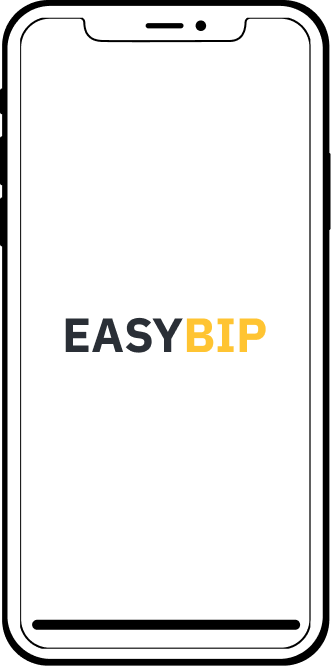

# Easy BIP
<p align="center">
  
</p>

## Client part (Front-end)
### Getting started
To start use this application you should run this commands in terminal.
``` bash
$ git clone https://github.com/Pobepto/easybip
$ cd easybip/client
$ yarn
```

**IMPORTANT** in our application we use `yarn` for dependency management if you do not have it, you should install it - [Installation | Yarn](https://yarnpkg.com/en/docs/install)

#### How to run
To run application, this will serve application with hot reload. 
``` bash
$ yarn serve
```

#### How to build
To build application for production
``` bash
$ yarn build
```

## Server part (Back-end)
TODO
